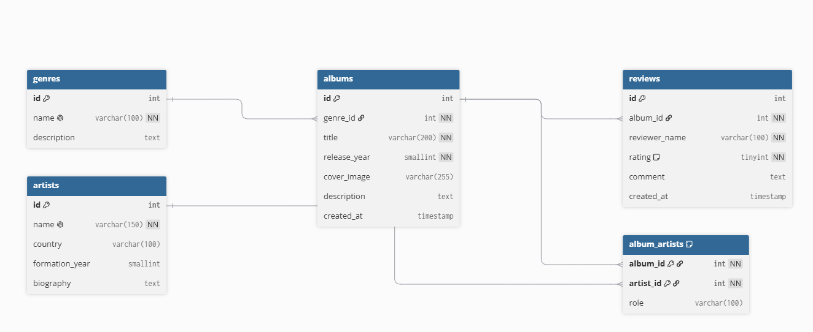

# Rockothèque

Rockothèque est une application web permettant de gérer une collection personnelle d’albums rock.

## Site en ligne

[Visiter Rockothèque](https://rockotheque-dmitriy.free.je)

## Fonctionnalités

- Afficher les albums
- Ajouter un album
- Modifier un album
- Supprimer un album
- Consulter et publier des avis
- Associer les albums aux artistes et aux genres

## Technologies utilisées

- PHP orienté objet
- MySQL
- PDO
- HTML
- CSS

## Installation

1. Importer le fichier `database.sql` dans MySQL.
2. Copier `config/database.example.php` vers `config/database.local.php`.
3. Indiquer les informations de connexion MySQL dans `database.local.php`.
4. Démarrer le serveur PHP avec :

```bash
php -S localhost:8000
```

## Schéma de la base de données


