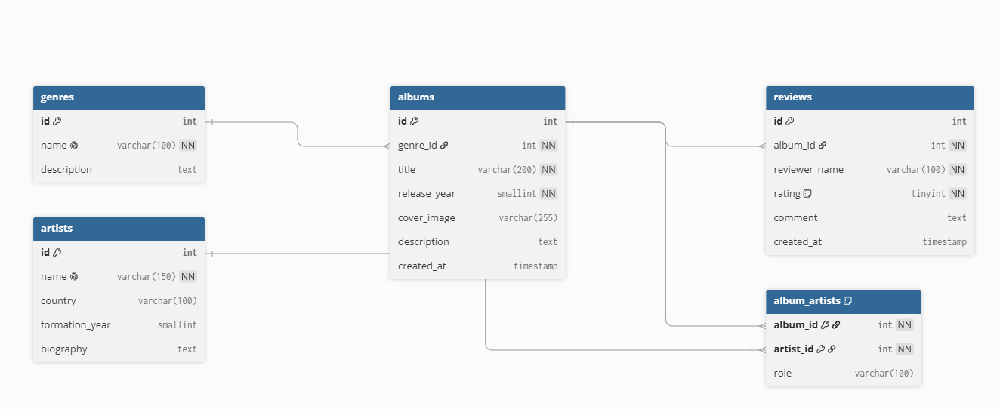

# Rockothèque — TP2 MVC

Rockothèque est une application web permettant de gérer une collection
personnelle d’albums rock. Ce projet poursuit le TP1 avec une migration
vers l’architecture MVC.

## Liens

- Site : https://rockotheque-dmitriy.free.je
- GitHub : https://github.com/Dishmish/rockotheque

## Fonctionnalités

- Consulter les albums, leurs artistes et leurs genres.
- Ajouter, modifier et supprimer un album.
- Consulter et publier des avis.
- Afficher la note moyenne des albums.
- Valider les données et les relations avant leur enregistrement.
- Protéger les formulaires avec un jeton CSRF.

## Technologies

PHP orienté objet, MySQL, PDO, Twig, Composer, HTML et CSS.

## Architecture MVC

- `app/Models` : accès aux données.
- `app/Controllers` : traitement des requêtes et validation.
- `app/Views` : affichage avec Twig.
- `public/index.php` : contrôleur frontal et routage.
- `public/css` : styles.
- `config` : connexion à la base de données.

## Installation locale

1. Installer PHP avec PDO MySQL et Composer.
2. Exécuter `composer install`.
3. Importer `database.sql` dans MySQL.
   Attention : ce script supprime et recrée la base `rockotheque`.
   Ne pas l’exécuter sur une base contenant des données à conserver.
4. Copier `config/database.example.php` vers
   `config/database.local.php` et renseigner la connexion.
5. Depuis la racine du projet, démarrer le serveur :

```bash
php -S localhost:8001 -t public
```

6. Ouvrir http://localhost:8001.

## Hébergement Apache

Le dossier `public` peut être utilisé comme racine du site.

Lorsque le projet est placé entièrement dans `htdocs`, le fichier
`.htaccess` à la racine dirige les requêtes vers `public/index.php`
et les fichiers CSS vers `public/css`.

Les règles nécessitent le module Apache `mod_rewrite` et
l’autorisation des fichiers `.htaccess`.

Installer les dépendances avant leur transfert :

```bash
composer install --no-dev --optimize-autoloader
```

Conserver sur le serveur son propre `config/database.local.php`.
Ne pas publier les identifiants de connexion dans GitHub.

## Schéma de la base de données


